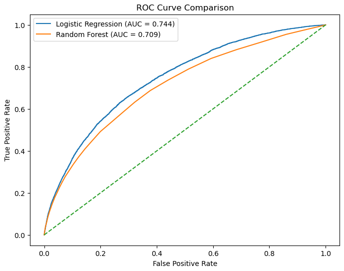
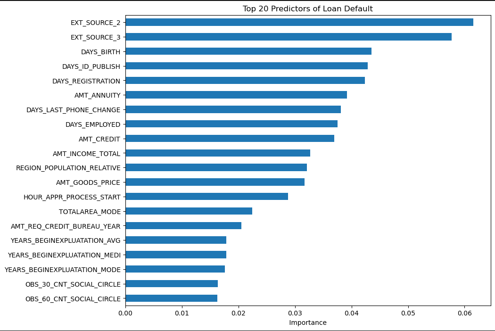

# credit-risk-prediction-ml
Machine learning model to predict loan default risk using the Home Credit dataset (300K+ borrowers). Includes data preprocessing, logistic regression baseline, random forest comparison, and ROC-AUC evaluation.

# Credit Default Risk Prediction

This project builds a machine learning model to estimate the probability that a borrower will default on a loan. Using the Home Credit Default Risk dataset containing over 300,000 loan applications, the analysis explores patterns in borrower financial characteristics and credit behavior associated with default risk.

The workflow includes data preprocessing, exploratory data analysis, feature evaluation, and predictive modeling. A logistic regression model was used as the baseline model and compared against a random forest classifier. Model performance was evaluated using ROC-AUC and classification metrics to understand predictive accuracy and risk separation.

---

## Dataset

Dataset: **Home Credit Default Risk (Kaggle)**

The dataset contains borrower application information including:

- income levels  
- loan amount  
- employment duration  
- demographic characteristics  
- external credit scores  

Target variable:

`TARGET = 1` → borrower default  
`TARGET = 0` → borrower repaid loan  

---

## Modeling Approach

The project followed a standard analytics workflow:

1. Data loading and preprocessing  
2. Handling missing values  
3. Feature selection  
4. Train/test split  
5. Logistic Regression baseline model  
6. Random Forest comparison  
7. Model evaluation using ROC-AUC  

---

## Model Performance

The logistic regression model achieved an ROC-AUC of approximately **0.74**, outperforming the random forest baseline in this experiment. This indicates moderate predictive power in separating borrowers likely to default from those likely to repay.

---

## Feature Importance

The strongest predictors of default include external credit scores, borrower age, loan amount, and employment history. These factors align with typical variables used in real-world credit risk modeling.

---

## Technologies Used

- Python  
- pandas  
- numpy  
- scikit-learn  
- matplotlib  
- seaborn  
- Jupyter Notebook
